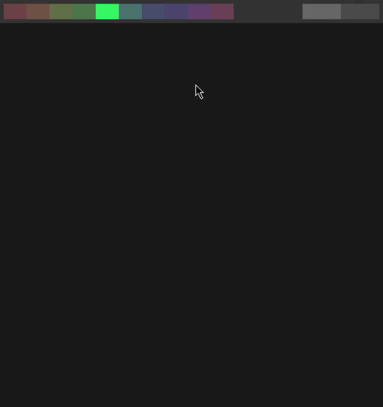

## Inspiration
I think fractals are really cool. Thier algorithms are often fairly simple as well. Perfect for my first hackathon!

## What it does
Uses chaos game / chaos theory to build fractal structures. When applied in the right way, and if you have a bit of creativity, it creates christmas trees.

[The wikipedia page](https://en.wikipedia.org/wiki/Chaos_game)

[A great article about programming it](https://beltoforion.de/en/recreational_mathematics/chaos_game.php)

## How we built it
I used Rust and Piston2d to create this. It's a fairly simple algorithm; just finding a point between two other points.

## Challenges we ran into
The math behind the various colours was a bit difficult to get how I wanted, but ultimately I figured it out.

## Accomplishments that I'm proud of
There are definitely some things that could be improved, and there are some feature's I'd like to add, but overall I'm happy with how it turned out

## What we learned
This is my first hackathon, so I didn't pick something super challenging. Because of this, I didn't learn any specific skills.
This was still good practice in math on a cartesian plane, algorithms, and project management

## What's next for Chaotic Christmas!
I'm looking at adding a lot of new features. Those include, but are not limited to, UI, presets, and algorithm changes.

## Usage
You can use 10 different fractals at a time. Use the controls below to define and manage them.

### Starting
The program takes 4 arguments in order. 
1. Window width
2. Window height
3. Iterations for each fractal
4. Opacity for every point

For example, recommended settings: `cargo run 500 500 100000 0.01`

### Controls
* Number keys -> Change fractal slot
* Enter       -> Generate selected fractal
* Up / Down   -> Increase or decrease jump size
* Space       -> Sets the optimal jump size for the fractal
* C           -> Clear current fractal
* Comma       -> Change vertex visibility
* Period      -> Change fractal visibility
* Left click  -> Add vertex on cursor
* Right click -> Remove vertex on cursor

You can also iteract with the bars on top to change slot and jump size

### Showcase
Me creating a Christmas tree. This is by no means the only thing you can create using this.

